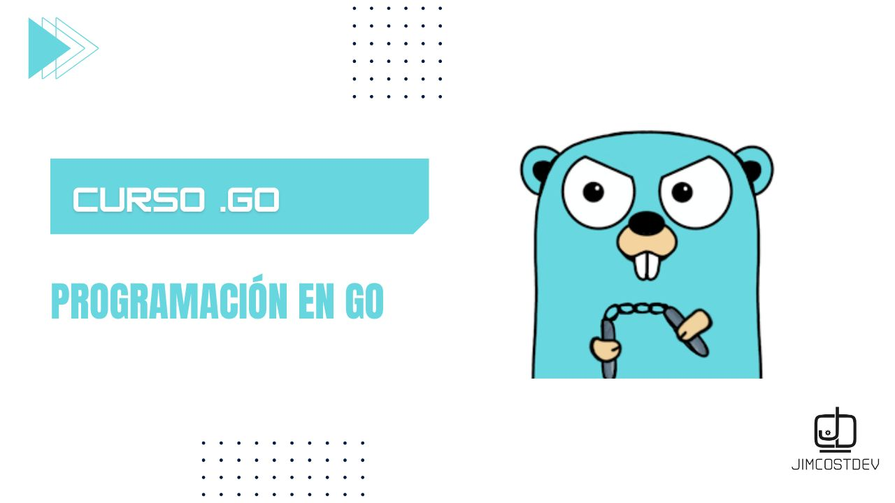

# 📘 Programación en Go  

Material complementario al libro **"Programación en Go"** de la Editorial Marcombo, junto con mis apuntes personales y recursos adicionales.  

📖 **Autor del libro:** [Mario Macías Lloret](http://macias.info)  

## 📂 Contenido del repositorio  

✅ **Ejemplos del libro:** [examples-book/](./examples-book)  
✅ **Mis apuntes y recursos:** [jimcostdev/](./jimcostdev/)  
✅ **Guía de instalación:** [guia_instalacion_go.md](./guia_instalacion_go.md)  

## 🚀 Apóyanos con una ⭐  

Si este repositorio te resulta útil, ¡apóyalo con una estrella ⭐!  
Tu apoyo nos motiva a seguir creando más contenido y mejorar los recursos disponibles. ¡Gracias! 😊  

---

## Howdy, soy Ronaldo Jiménez 👋🏻
### Software Engineer & Web Developer :octocat:
<!-- banner -->

<!-- frase de EGW -->
 